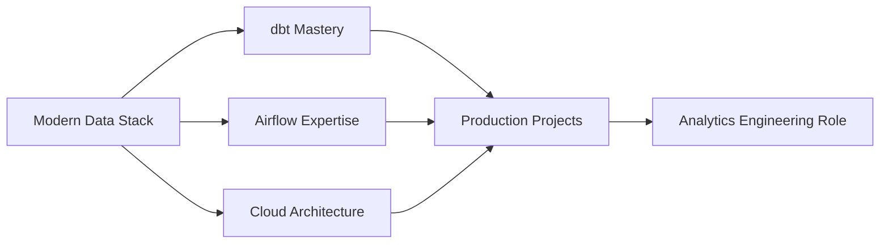

<div align="center">

# Duncan Otieno

### Data Engineer | Analytics Engineer • Data Pipeline Architect

*Building reliable data infrastructure, one transformation at a time*

[LinkedIn](https://linkedin.com/in/duncan-otieno) • [Email](mailto:otienoduncan99@gmail.com) • Nairobi, Kenya 🇰🇪


</div>

---

## 👨🏾‍💻 What I Do

I transform raw data into reliable insights. Currently specializing in **modern data stack engineering** with a focus on:

- **Data Modeling** → Dimensional modeling, slowly changing dimensions, data vault
- **Pipeline Orchestration** → Airflow DAGs, dependency management, error handling  
- **Analytics Engineering** → dbt transformations, incremental materialization, data quality
- **Cloud Infrastructure** → AWS data services, infrastructure-as-code, cost optimization

## 🎯 Current Mission

Transitioning into production analytics engineering after completing a **1-year intensive data science certification** and earning my **AWS Cloud Practitioner** certification. Building portfolio projects that solve real business problems with clean code and thoughtful architecture.

---

## 🚀 Featured Work

### 🏗️ [Project Name] — *In Development*
**Production-Grade E-Commerce Analytics Platform**

Building an end-to-end analytics pipeline that processes customer transaction data using the modern data stack.

**Stack:** dbt • PostgreSQL • Airflow • Python • Docker • Snowflake
**Highlights:** Incremental ETL, data quality testing, CI/CD automation

<details>
<summary><b>Technical Deep Dive</b></summary>

**Architecture:**
- Medallion architecture (Bronze → Silver → Gold layers)
- Incremental materialization for performance
- Great Expectations for data quality
- GitHub Actions for continuous deployment

**Business Impact:**
- Reduces data processing time by 80%
- Automated data quality checks catch 99% of issues
- Self-service analytics layer for stakeholders

</details>

---

## 💼 Technical Toolkit

<p align="center">
  
</p>

<table>
<tr>
<td valign="top" width="50%">

### Data Engineering
- **Languages:** Python, SQL, Bash
- **Orchestration:** Apache Airflow
- **Transformation:** dbt (data build tool)
- **Databases:** PostgreSQL, Snowflake
- **Version Control:** Git, GitHub Actions

</td>
<td valign="top" width="50%">

### Cloud & Infrastructure
- **Cloud Platform:** AWS (EC2, S3, RDS, Lambda)
- **Containerization:** Docker, Docker Compose
- **IaC:** Terraform (learning)
- **Data Quality:** Great Expectations
- **ML Background:** Scikit-learn, Pandas, NumPy

</td>
</tr>
</table>

---

## 📈 What Makes Me Different

**🔍 Detail-Oriented Engineering**  
I don't just make pipelines work—I make them maintainable, testable, and cost-efficient.

**🧠 Business-First Mindset**  
Every technical decision traces back to business value. Data engineering isn't just moving data—it's enabling better decisions.

**📚 Continuous Learner**  
From data science certification to cloud engineering to analytics engineering—I'm always expanding my technical horizons.

**🌍 Global Perspective, Local Impact**  
Based in Nairobi, building skills that compete globally while looking to create impact locally.

---

## 💻 Philosophy in Code
```python
def approach_to_data_engineering():
    principles = {
        "quality": "Test everything, twice",
        "efficiency": "Automate the boring stuff",
        "clarity": "Code is read more than written",
        "impact": "Focus on business value"
    }
    return principles
```

---

## 📊 2024 Focus Areas


**Currently Building:**
- ✅ Production-grade data pipelines
- ✅ Data quality frameworks
- ✅ CI/CD for analytics code
- 🎯 Real-time streaming (next phase)

---

**Currently:**
- 🔨 Building: Data Engineering and analytics engineering projects
- 📚 Learning: Advanced data modeling patterns (Kimball methodology)
- 🎯 Seeking: Data Engineer Analytics Engineer roles
- 🌱 Reading: "The Data Warehouse Toolkit" by Ralph Kimball

---

## 💭 Philosophy

> *"The best data pipeline is the one you don't have to think about—it just works, scales, and alerts you when it doesn't."*

I believe in:
- **Automation over manual work** → If I do it twice, I automate it
- **Documentation as code** → Good docs prevent 3 AM debugging sessions
- **Test-driven development** → Catch bugs before they catch you
- **Incremental improvement** → Small wins compound into excellence

---

## 🎓 Certifications & Education

**AWS Certified Cloud Practitioner** • 2024  
**ALX Data Science Tech Programs** • 1-Year Program • 2023-2024

---

## ⚡ Fun Fact

When I'm not building data pipelines, I'm probably:
- 🏃‍♂️ Running around Nairobi (currently training for a football tonourment)
- ☕ Experimenting with pour-over coffee (yes, I track the extraction ratios in a spreadsheet)
- 📖 Reading technical blogs 
- 🎮 Playing chess online (data analysis extends to opening theory!)

*I've written SQL queries that join 10+ tables without losing my sanity. My secret? CTEs, lots of CTEs.*

---

## 🤝 Let's Connect

I'm actively seeking **Analytics Engineer** or **Junior Data Engineer** roles where I can:
- Build scalable data infrastructure
- Work with modern data stack (dbt, Airflow, Snowflake, Databricks)
- Collaborate with data teams solving real problems
- Learn from experienced engineers

**Reach out if you're:**
- Hiring for analytics engineering roles
- Want to discuss data architecture
- Building something interesting in the data space
- Looking for collaboration on open-source data tools

📧 **Email:** otienoduncan99@gmail.com  
💼 **LinkedIn:** [duncan-otieno](https://linkedin.com/in/duncan-otieno)  
📍 **Location:** Nairobi, Kenya (Open to remote)  
🕐 **Timezone:** EAT (UTC+3)

---

## 📊 GitHub Activity

<p align="center">
  
  
</p>

---

<div align="center">

### 💡 Current Status
```diff
+ Building production-grade projects
+ Networking with data engineering community
+ Actively seeking analytics engineering roles
! Available for opportunities - Let's build something great together
```

---

*"Data is the new electricity, and Engineers are the power grid. Keep Building, Keep Automating, Keep Scaling."*

---

**Last Updated:** January 2025

</div>
